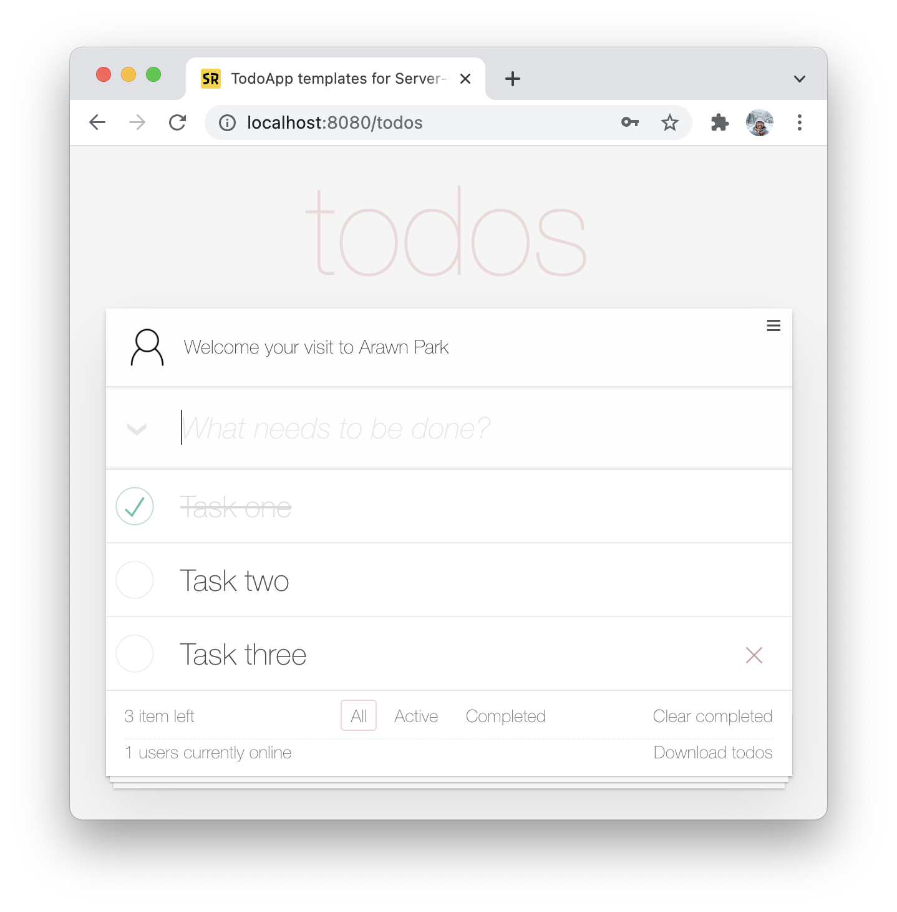

# Mastering Spring Web 101 Templates

본 프로젝트는 Mastering Spring Web 101 워크숍(강좌)에서 사용할 템플릿 프로젝트입니다.

Mastering Spring Web 101 워크숍은 [Spring MVC](https://docs.spring.io/spring-framework/docs/current/reference/html/web.html)와 [Spring Boot](https://spring.io/projects/spring-boot)로 웹 애플리케이션 서버 사이드(Server-side)를 직접 개발하며 학습하는 워크숍입니다. 참가자는 Spring MVC의 핵심인 HTTP 요청 연결, 데이터 바인딩, 응답 및 예외 처리 방법을 배우고 경험 할 수 있습니다.

* Spring MVC와 Spring Boot가 제공하는 다양한 웹 기능을 학습할 수 있습니다.
* 웹 애플리케이션에 서버 사이드 전체를 개발해보는 경험을 할 수 있습니다.
  - 프론트엔드 엔지니어와 협업하며 프로젝트를 수행하는 것과 유사한 경험을 할 수 있습니다.
  - 보편적인 웹 애플리케이션 아키텍처를 엿볼 수 있습니다.

## TodoApp

워크숍 참가자는 제공되는 애플리케이션 정의서와 Web API 정의서, 그리고 [웹 클라이언트](https://github.com/springrunner/todoapp-client)로 할 일 관리 웹 애플리케이션에 서버 사이드를 개발합니다.

가이드 러너가 라이브 코딩과 함께 Spring MVC(또는 Spring Boot)에 기능을 설명해주면, 참가자는 해당 코드를 직접 작성하고 실행-테스트 하는 과정을 반복하며 완전한 웹 애플리케이션을 개발해보는 방식으로 워크숍이 진행됩니다.

## Templates
* todoapp-client는 [Thymeleaf](https://www.thymeleaf.org/)와 [Vue.js](https://vuejs.org/)로 개발된 웹 클라이언트입니다.
* todoapp-server는 스프링부트 기반으로 작성된 서버 템플릿 프로젝트입니다.

### 개발환경
- Java SE 11 & Jakarta EE 8
- Spring Framework 5.x
- Spring Boot 2.5.x
- Gradle 7.2

강좌(워크숍)에 대한 자세한 소개는 [여기](https://springrunner.dev/training/mastering-spring-web-101-workshop/)에서 볼 수 있습니다.