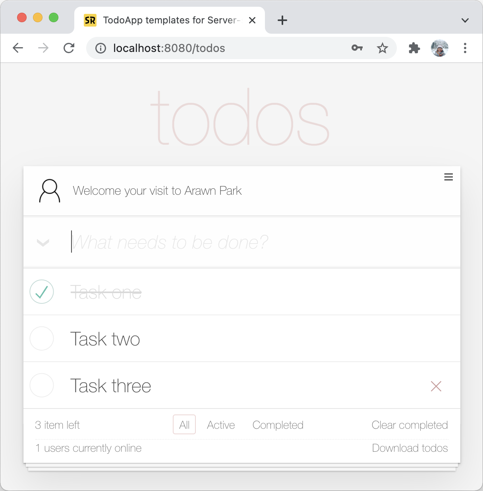

# Mastering Spring Web 101 Workshop

> 이 프로젝트는 Mastering Spring Web 101 워크숍(강좌)를 위해 만들어진 Todoapp 웹 애플리케이션입니다.

Mastering Spring Web 101 워크숍은 [Spring MVC](https://docs.spring.io/spring-framework/docs/current/reference/html/web.html)와 [Spring Boot](https://spring.io/projects/spring-boot)로 웹 애플리케이션 서버 사이드(Server-side)를 직접 개발하며 학습하는 워크숍입니다. 참가자는 Spring MVC의 핵심인 HTTP 요청 연결, 데이터 바인딩, 응답 및 예외 처리 방법을 배우고 경험 할 수 있습니다.

워크숍에 대한 자세한 소개는 [여기](https://springrunner.dev/training/mastering-spring-web-101-workshop/)에서 볼 수 있습니다.

## I. Todoapp

  

`Todoapp` 웹 애플리케이션은 할일 목록 기능을 제공하는 웹 애플리케이션입니다. 사용자는 할일을 등록, 완료, 삭제 및 수정할 수 있으며, 할일을 CSV 파일로 다운로드 받을 수 있습니다. 추가적으로 사용자 로그인 및 로그아웃, 프로필 이미지 변경 기능을 포함합니다.

### 요구사항

#### 기능

* 할일 관리
  - 사용자는 할일 목록을 조회할 수 있습니다.
  - 사용자는 완료 여부로 할일 목록을 필터링할 수 있습니다.
  - 사용자는 새로운 할일을 추가할 수 있습니다.
  - 사용자는 완료된 할일을 완료 상태로 표시할 수 있습니다.
  - 사용자는 할일을 삭제할 수 있습니다.
  - 사용자는 기존 할일의 내용을 수정할 수 있습니다.
  - 사용자는 할일을 CSV 파일로 다운로드 받을 수 있습니다. (다운로드 시점의 모든 할일이 포함됩니다.)
* 사용자 관리
  - 사용자는 자신의 계정으로 로그인할 수 있습니다.
  - 사용자는 로그아웃할 수 있습니다.
  - 사용자는 자신의 프로필 이미지를 업로드하고 변경할 수 있습니다.

#### 비기능

* 애플리케이션은 사용자가 증가함에 따라 수평적으로 확장 가능해야 합니다.
* 데이터베이스와 서버는 확장 가능한 구조로 설계되어야 합니다.
* 사용자 비밀번호는 해시 및 암호화하여 저장해야 합니다.
* 모든 API 엔드포인트는 인증 및 인가 절차를 거쳐야 합니다.
* 코드베이스는 모듈화되고 잘 주석 처리되어 있어야 합니다.
* 오류가 발생했을 때 사용자에게 친절하게 안내해야 합니다.
* 모바일 기기에서도 원활하게 사용할 수 있어야 합니다.

### 클라이언트 사이드(Client-side)

Todoapp 웹 애플리케이션의 클라이언트 사이드는 웹 기술(HTML, CSS, JavaScript)을 기반으로 만듭니다.

### 서버 사이드(Server-side)

Todoapp 웹 애플리케이션의 서버 사이드는 자바(Java)와 스프링(Spring)을 기반으로 만듭니다.

## II. 라이선스
저장소 내 모든 내용은 [MIT 라이선스](LICENSE.md)로 제공됩니다.
