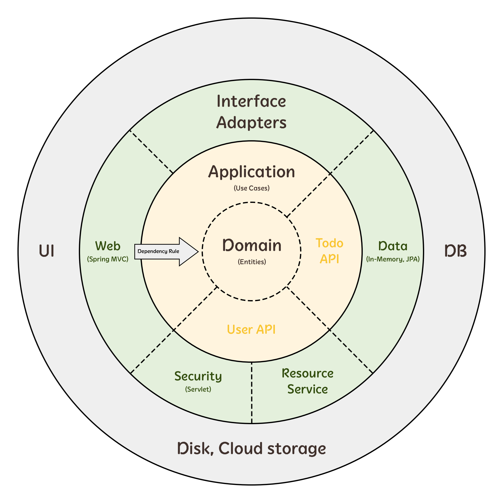

# Todoapp Server-side

> 이 프로젝트는 [Spring MVC](https://docs.spring.io/spring-framework/docs/current/reference/html/web.html)
> 와 [Spring Boot](https://spring.io/projects/spring-boot)로 개발된 웹 애플리케이션 서버입니다.

Todoapp 웹 애플리케이션 서버는 다음과 같은 엔드포인트(endpoint)로 구성되어있습니다.

### 할일 관리 페이지 컨트롤러

* `/todos`: 할일 목록 페이지를 반환합니다.
* `/todos Accept: text/csv`: 할일 목록을 CSV 형식으로 반환합니다.

### 로그인 및 사용자 프로필 페이지 컨트롤러

* `GET /login`: 로그인 페이지를 반환합니다. 현재 로그인된 사용자가 있다면 `/todos`로 리다이렉트합니다.
* `POST /login`: 사용자 이름과 비밀번호를 입력받아 사용자 로그인을 처리합니다.
* `/logout`: 현재 로그인된 사용자를 로그아웃을 처리하고 `/todos`로 리다이렉트합니다.
* `/user/profile-picture`: 현재 로그인된 사용자 프로필 이미지 리소스를 반환합니다.

### 할일 Web API

* `GET /api/todos`: 할일 목록을 반환합니다.
* `POST /api/todos`: 새로운 할일 항목을 추가합니다.
* `PUT /api/todos/{id}`: 기존 할일 항목을 수정합니다.
* `DELETE /api/todos/{id}`: 할일 항목을 삭제합니다.

### 사용자 프로필 Web API

* `GET /api/user/profile`: 현재 로그인된 사용자의 프로필 정보를 반환합니다. 로그인되지 않은 경우 401 Unauthorized 상태를 반환합니다.
* `POST /api/user/profile-picture`: 현재 로그인된 사용자 프로필 이미지를 변경합니다.

### 기타 Web API

* `GET /api/feature-toggles`: 현재 활성화된 기능 토글 정보를 반환합니다.
* `GET /stream/online-users-counter`: 현재 접속된 사용자 수를 이벤트 스트림으로 전송합니다.
    - 이벤트 스트림은 [Server-sent events](https://en.wikipedia.org/wiki/Server-sent_events) 명세를 구현되었습니다.

## I. 프로젝트 구성

이 프로젝트는 자바와 스프링 MVC, 그리고 스프링 부트를 사용해 개발하고, 그레이들(Gradle)로 관리하고 있습니다. 스프링 MVC라는 견고한 웹 프레임워크 기반 위에, 스프링 부트의 자동 구성 및 내장 서버
기능을 통해 개발 생산성을 극대화했습니다. 특히, 그레이들의 유연한 빌드 시스템과 의존성 관리는 복잡한 설정을 최소화하고, 빠르고 효율적인 개발 환경을 제공합니다.

> [Spring MVC](https://docs.spring.io/spring-framework/docs/current/reference/html/web.html)는
> 오랜 기간 동안 수많은 프로젝트에서 검증된 웹 프레임워크로,
> Model-View-Controller (MVC) 패턴을 기반으로 애플리케이션의 구조를 명확하게 분리하여 유지보수성과 확장성을 높입니다.
> 또한, 다양한 기능을 제공하여 개발자가 비즈니스 로직에 집중할 수 있도록 돕습니다.
>
> [Spring Boot](https://spring.io/projects/spring-boot)는 스프링 기반 애플리케이션 개발을 위한 편리한 도구입니다.
> 자동 구성, 내장 웹 서버, 간편한 의존성 관리 등 다양한 기능을 제공하여 개발자가 복잡한 설정에 시간을 낭비하지 않고 핵심 기능 구현에 집중할 수 있도록 돕습니다.
>
> [Gradle](https://gradle.org)은 빌드 도구로, 유연한 설정과 강력한 기능을 제공합니다.
> 특히, 스프링 부트와의 뛰어난 호환성을 통해 빌드 및 배포 과정을 간소화하고 자동화할 수 있습니다.

### 애플리케이션 아키텍처

서버 사이드 애플리케이션은 클린 아키텍처(Clean Architecture)를 기반로 설계되기를 기대합니다.
클린 아키텍처가 정의하는 다양한 요소가 있지만, 본 프로젝트에서는 외부(adapters)에서 내부(core)로 들어가는 의존성 방향과 영역별 역할만 중요하게 보도록 하겠습니다.

<p align="center">
  
</p>

* 애플리케이션 핵심 로직이 담긴 내부(core)는 애플리케이션과 도메인 영역으로 구성되었습니다.
    - 도메인(domain) 영역은 모델과 비즈니스 논리가 위치하며, 가능한 한 프레임워크나 외부 기술에 의존하지 않도록 작성합니다.
    - 애플리케이션(application) 영역은 도메인 로직을 활용해 구체적인 업무 처리를 수행하며, 오직 도메인 영역에만 의존해야 합니다.
* 나머지(웹, 데이터, 보안 등)는 언제든 갈아끼울 수 있는 외부(adapters)로 두고, 핵심 로직이 외부 기술 변경에 영향을 받지 않도록 구성합니다.
    - 인터페이스 어댑터(interface adapters)는 내부(core)에 의존하며 구체적인 기술(Servlet, File, Database, Spring 등)을 사용해 내부로 연결합니다.
    - UI(user interface)는 사용자와 상호작용하는 클라이언트-사이드 영역으로, 브라우저를 통해 서버와 통신을 통해 서비스를 제공합니다.
    - DB(database)는 JDBC 드라이버로, 스토리지(disk, cloud)는 SDK로 인터페이스 어댑터에 연결됩니다.

### 디렉토리 구조

```
├── src
│   ├── main                    # 애플리케이션에서 사용할 소스 코드와 리소스 파일
│   │   ├── java
│   │   │   └── todoapp
│   │   │       ├── core        # 도메인 모델과 비즈니스 논리, 사용 사례(use cases)가 배치된 애플리케이션의 핵심 모듈
│   │   │       ├── security    # 보안(인증/인가)에 관련된 로직을 처리하기 위한 어댑터 모듈
│   │   │       ├── data        # 데이터 접근(DB 접근, 외부 API 연동 등)에 관련된 로직을 처리하기 위한 어댑터 모듈
│   │   │       └── web         # 웹 요청과 응답에 관련된 로직을 처리하기 위한 어댑터 모듈 
│   │   └── resources
│   └── test                    # main 디렉토리에 작성된 애플리케이션의 테스트 코드와 리소스 파일
│       ├── java
│       └── resources
├── build.gradle                # 이하 그레이들 빌드 스크립트
└── settings.gradle
```

### 의존성 관리

의존성 관리를 위해 [Gradle](https://gradle.org/)을 사용하며, 서버 개발에 사용된 의존성은 빌드 스크립트(`build.gradle`)에 선언되어 있습니다.

### 프로젝트 설정

> 프로젝트 설정을 위해서 `Java 21`과 `Gradle`이 설치되어 있어야 합니다.
> 익숙하지 않다면 스프링러너 [그레이들 프로젝트 구성하기](https://www.youtube.com/watch?v=x5lWmaSzPVQ) 테크톡을 통해 배울 수 있습니다.

```
❯ git clone https://github.com/springrunner/mastering-spring-web-101.git
❯ cd mastering-spring-web-101/server
❯ ./gradlew clean build
```

## II. 빌드 및 실행 방법

저장소를 복제하거나 압축 파일로 다운로드한 후 터미널에서 다음과 같은 방법으로 실행할 수 있습니다.

```
❯ git clone https://github.com/springrunner/mastering-spring-web-101.git
❯ cd mastering-spring-web-101/server
❯ ./gradlew bootRun
```

# III. 참고자료

* [The Clean Architecture](https://blog.cleancoder.com/uncle-bob/2012/08/13/the-clean-architecture.html)
